# MediPay Agent — Current System Architecture
## AI Assistant for Vietnamese Health Insurance (BHYT) & Hospital-Fee Information

> **Document purpose:** mô tả **đúng kiến trúc của phiên bản project hiện tại** trong repository cũ, dùng để trình bày với supervisor và làm baseline cho các bước nghiên cứu/nâng cấp tiếp theo.
>
> **Important:** tài liệu này phân biệt rõ:
> - ✅ **Implemented / request-time:** đang thực sự chạy trong flow chatbot.
> - 🟡 **Built but not fully integrated:** đã có code/data structure nhưng chưa tham gia đầy đủ vào runtime.
> - 🔵 **Planned research direction:** hướng nâng cấp, **không trình bày như feature đã hoàn thành**.

---

# 1. Project Summary

**MediPay Agent** là hệ thống AI hỗ trợ người dùng tra cứu và giải thích thông tin liên quan đến:

- Bảo hiểm Y tế (BHYT).
- Quyền lợi và mức hưởng.
- Quy định, văn bản pháp luật liên quan.
- Một phần định hướng về viện phí và quy trình thanh toán.

Mục tiêu cốt lõi là xây dựng một chatbot **grounded**: AI không chỉ trả lời từ kiến thức có sẵn của LLM, mà phải tìm **evidence từ corpus pháp lý**, sau đó mới sinh câu trả lời và trả lại citation.

### Core idea

```text
User question
    ↓
Retrieve legal evidence
    ↓
Expand related legal documents with a graph
    ↓
Give evidence to LLM
    ↓
Generate grounded answer
    ↓
Return citations
```

---

# 2. Current Architecture at a Glance

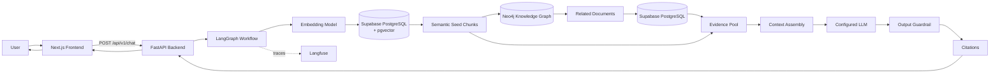

## One-sentence explanation

> **MediPay hiện tại là một single-agent GraphRAG workflow: dùng pgvector để tìm tài liệu ban đầu, Neo4j để mở rộng sang văn bản liên quan, sau đó hydrate evidence từ PostgreSQL và đưa evidence cho LLM để tạo câu trả lời có citation.**

---

# 3. Technology Stack

| Layer | Technology | Current role |
|---|---|---|
| Frontend | Next.js, React, TypeScript | Chat UI, citation drawer, admin prototype |
| API | FastAPI, Pydantic | REST API, validation, error handling |
| Agent orchestration | LangGraph | Điều phối các bước của GraphRAG |
| Relational DB | Supabase PostgreSQL | Canonical documents, chunks, legal units, tables, dataset release |
| Vector search | `pgvector` | Semantic retrieval |
| Graph DB | Neo4j | Quan hệ giữa các văn bản |
| Embedding | OpenAI-compatible embedding API | Embed query/chunks, 1536 dimensions |
| LLM | OpenAI/OpenRouter-compatible adapter | Sinh câu trả lời |
| Observability | Langfuse | Trace embedding, retrieval, graph, LLM |
| Evaluation | RAGAS + deterministic gates | Đánh giá retrieval/answer quality |
| Container | Docker | Backend deployment |
| Local orchestration | Docker Compose | Chạy backend, kết nối Supabase + Neo4j |

---

# 4. Repository Architecture

```text
Group project/
│
├── src/
│   ├── main.py                  # FastAPI application + middleware + health checks
│   ├── config.py                # Runtime configuration
│   │
│   ├── api/
│   │   └── routes.py            # /chat, /analyze, /status
│   │
│   ├── agents/
│   │   ├── graph.py             # LangGraph workflow
│   │   ├── state.py             # AgentState
│   │   ├── prompts.py           # System prompt + fallback
│   │   └── nodes/
│   │       └── graphrag_nodes.py
│   │
│   ├── services/
│   │   ├── chat.py              # Main request-time GraphRAG runtime
│   │   └── llm.py               # LLM provider
│   │
│   ├── db/
│   │   ├── session.py           # Async DB session
│   │   ├── repositories.py      # PostgreSQL + Neo4j retrieval boundary
│   │   └── models.py
│   │
│   ├── integrations/
│   │   ├── embeddings.py
│   │   ├── neo4j.py
│   │   ├── llm.py
│   │   └── langfuse.py
│   │
│   ├── graph_rag/
│   │   ├── chunking.py
│   │   ├── extraction.py
│   │   ├── ingestion.py
│   │   └── retrieval.py
│   │
│   └── models/
│       ├── graph.py
│       └── schemas.py
│
├── database/
│   ├── schema.sql               # Supabase/PostgreSQL + pgvector schema
│   ├── pipeline/                # Offline data preparation
│   ├── neo4j/                   # Graph importer + local Neo4j Docker
│   └── firebase/                # Authentication scaffold
│
├── web/
│   ├── app/                     # Next.js pages
│   ├── components/              # Chat/admin components
│   └── lib/api.ts               # FastAPI client
│
├── eval/                        # Golden dataset + RAGAS evaluation
├── Dockerfile
├── docker-compose.yml
└── requirements.txt
```

---

# 5. Runtime Request Flow — What Actually Happens Today

Đây là flow quan trọng nhất khi thầy hỏi:

> **“Một câu hỏi đi qua hệ thống của em như thế nào?”**

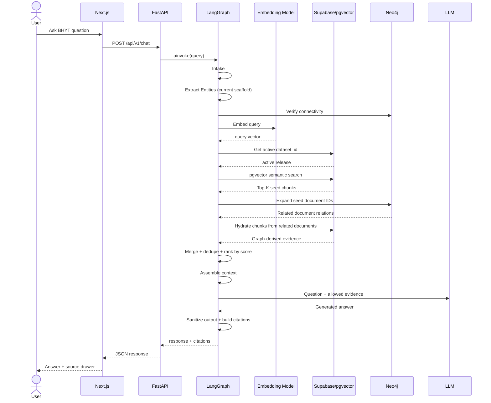

---

# 6. LangGraph Agent Architecture

## Current workflow

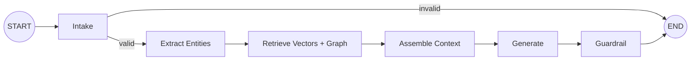

## State carried between nodes

Current `AgentState` includes:

```text
query
entities
vector_results
graph_results
retrieved_evidence
citations
context
response
error
metadata
```

### Important clarification

This project currently uses **one LangGraph workflow**, not a real multi-agent architecture.

```text
Current:
ONE agent workflow
 ├── intake node
 ├── retrieval node
 ├── generation node
 └── guardrail node

NOT:
Supervisor Agent
 ├── Research Agent
 ├── Legal Agent
 ├── Verification Agent
 └── Writer Agent
```

The nodes are stages of one workflow, not separate autonomous agents.

---

# 7. Current Retrieval Architecture

## 7.1 Semantic Seed Retrieval

The current request-time retrieval starts with semantic search:

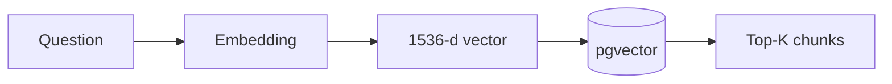

PostgreSQL computes cosine-like similarity using the pgvector distance operator and returns chunks above a configurable threshold.

Current defaults include approximately:

```text
retrieval_top_k = 5
semantic_similarity_threshold = 0.25
```

### Why semantic retrieval?

Because user wording may differ from legal wording.

Example:

```text
User:
"Tôi khám ở bệnh viện khác nơi đăng ký thì BHYT trả thế nào?"

Legal text:
"Khám chữa bệnh không đúng nơi đăng ký ban đầu..."
```

Exact words differ, but semantic meaning is related.

---

# 8. Neo4j Graph Expansion

Semantic search finds **seed documents**.

The system then sends their `document_id`s to Neo4j.

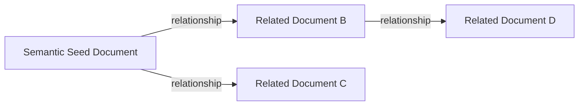

Neo4j is used for:

- document-to-document relationships;
- amendment/replacement/related legal document links;
- graph-neighborhood expansion.

## Key design idea

> **Neo4j is mainly a navigation layer, not the canonical text store.**

After Neo4j identifies related documents, the application returns to PostgreSQL to hydrate text chunks.

```text
Neo4j:
"Look at Document B"

        ↓

PostgreSQL:
"Here is the actual text from Document B"
```

This is safer than asking the LLM to treat a graph edge alone as complete legal evidence.

---

# 9. Evidence Hydration and Merge

After graph expansion:

```text
Semantic evidence
+
Chunks from graph-related documents
        ↓
Merge by chunk_id
        ↓
Deduplicate
        ↓
Combine retrieval channels
        ↓
Sort by score
        ↓
Keep max evidence budget
```

Current channels include:

```text
semantic
legal_graph
```

Current runtime limits include configurable values such as:

```text
graph_neighbor_limit
graph_evidence_limit
max_chunks_per_document
max_llm_evidence
max_citations
```

---

# 10. Context Assembly

Each selected evidence item is converted into a block similar to:

```text
EVIDENCE_ID=<chunk_id>
DOCUMENT_ID=<document_id>
TITLE=<document title>
SECTION=<section title>
TEXT=<evidence text>
```

Graph relationships are appended as additional context.

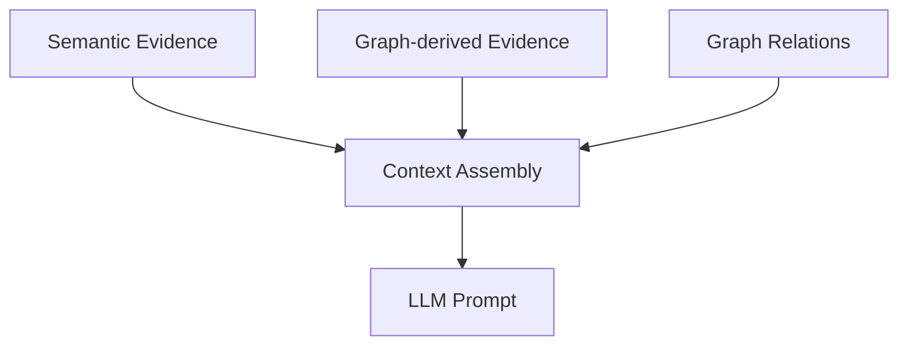

## Current limitation

The context is currently limited primarily using:

```text
max_context_chars
```

rather than a fully token-aware evidence packing strategy.

---

# 11. Generation and Grounding

The LLM receives:

```text
System Prompt
+
User Question
+
Allowed Evidence
+
Graph Relations
```

The intended behavior is:

```text
Enough evidence
    ↓
Grounded answer

No evidence
    ↓
Fallback / abstain
```

This is an important safety principle for a legal/health-administration domain:

> **No evidence means the system should avoid inventing an answer.**

---

# 12. Citation Architecture

The API returns:

```json
{
  "response": "...",
  "citations": [
    {
      "document_id": "...",
      "chunk_id": "...",
      "title": "...",
      "section_title": "...",
      "quote": "...",
      "channels": ["semantic"]
    }
  ]
}
```

Frontend then renders citations in a source/evidence drawer.

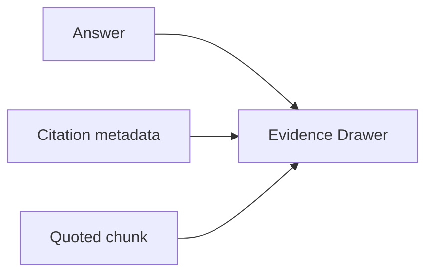

## Current citation behavior

Citations are currently selected from highest-ranked retrieved evidence.

### Current limitation

The system does **not yet perform full claim-level entailment checking** such as:

```text
Claim 1 → Evidence 4
Claim 2 → Evidence 7
Claim 3 → Evidence 2
```

This is an important future research direction.

---

# 13. Data Architecture

Supabase/PostgreSQL is the canonical structured store.

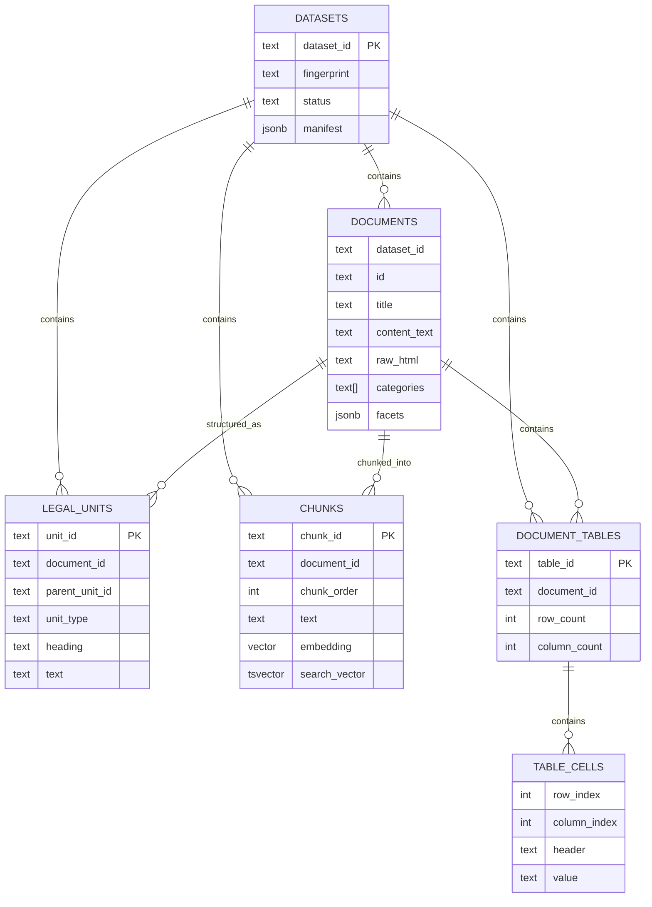

---

# 14. Dataset Release Model — A Strong Existing Design

One useful architectural feature already present in the old project is **release-scoped datasets**.

The system does not simply overwrite all legal data in place.

Instead:

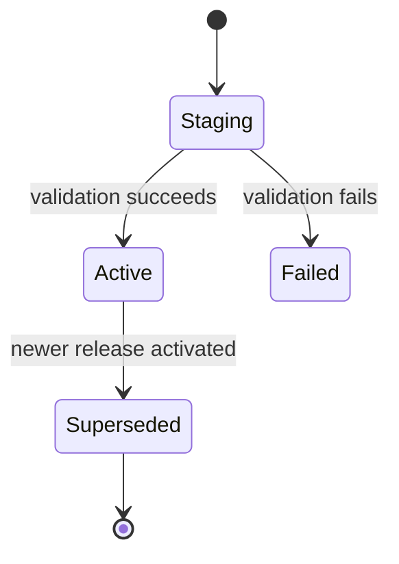

Tables include:

```text
datasets
dataset_state
```

`dataset_state.active_dataset_id` identifies the release currently served to users.

## Why this matters

Without release isolation:

```text
Import begins
↓
50% new data
+
50% old data
↓
User queries partially updated corpus
```

With release isolation:

```text
Build complete release in staging
↓
Validate
↓
Switch active_dataset_id
↓
Readers see one coherent release
```

This design is useful for reproducibility and future evaluation.

---

# 15. Offline Data Pipeline

The online chatbot can only work after the legal corpus has been processed.

Current offline pipeline contains:

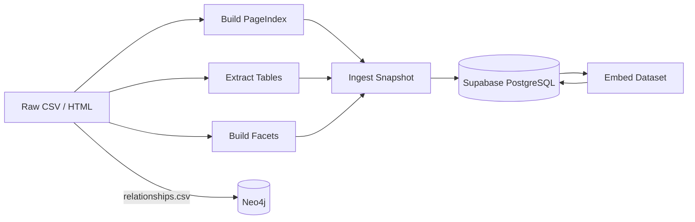

Typical pipeline commands:

```bash
python database/pipeline/scripts/build_page_index.py --source-dir data/raw \
  --output-dir data/clean/page_index

python database/pipeline/scripts/extract_tables.py --source-dir data/raw \
  --output-dir data/clean/tables

python database/pipeline/scripts/build_facets.py --source-dir data/raw \
  --output-dir data/clean/facets

python database/pipeline/scripts/ingest_snapshot.py --source-dir data/raw

python database/pipeline/scripts/embed_dataset.py <dataset_id> --batch-size 256
```

The repository documentation reports a prepared corpus on the order of:

```text
~15,471 passages
~646 tables
~26,079 table cells
```

These figures describe the prepared dataset state documented in the project and may change when the source corpus is rebuilt.

---

# 16. PageIndex Architecture

The project already includes an offline **PageIndex-like legal hierarchy**.

For Vietnamese legal documents, the hierarchy is modeled as:

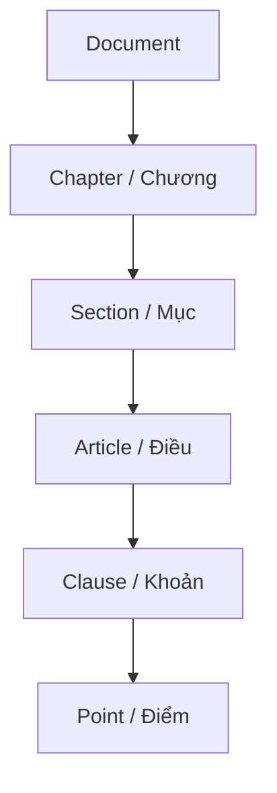

Each legal unit can store:

```text
unit_id
document_id
parent_unit_id
unit_type
ordinal_raw
heading
text
source_start
source_end
hash
parser_version
```

## Status

🟡 **Built offline, but not fully connected to the current request-time chatbot retrieval flow.**

This is important to say accurately to the supervisor.

---

# 17. Lexical Search Infrastructure

The `chunks` table already contains:

```text
search_vector tsvector
```

and a GIN index:

```text
dataset_chunks_search_idx
```

Therefore the database has infrastructure for lexical/full-text retrieval.

## Status

🟡 **Schema support exists, but current request-time `GraphRagRuntime` starts from pgvector semantic search; hybrid lexical + semantic fusion is not yet fully wired into the live chat path.**

This gives a natural research/engineering extension:

```text
Exact Search
+
Lexical Search
+
Semantic Search
        ↓
Fusion
        ↓
Better Retrieval
```

---

# 18. Table Extraction Architecture

The data pipeline can extract structured HTML tables into:

```text
document_tables
table_cells
```

This is useful because benefit levels, percentages and hospital-fee rules often appear in tables.

## Status

🟡 Stored and processed offline, but not yet a first-class request-time table retrieval channel.

Potential research question:

> Can structured table-aware retrieval improve numerical and eligibility questions compared with normal chunk embedding?

---

# 19. Conversation Architecture — Current Limitation

Frontend currently maintains chat history and sends:

```json
{
  "message": "...",
  "chat_history": [...]
}
```

The backend Pydantic schema accepts `chat_history`.

However, current `/chat` implementation invokes the agent with only:

```text
query = request.message
```

So the LangGraph runtime does **not yet use conversation history**.

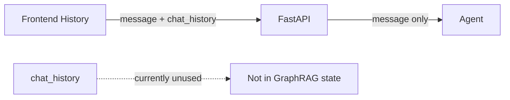

## Consequence

Conversation:

```text
User: "Thông tư X quy định mức hưởng thế nào?"
AI: ...

User: "Còn khoản 2 thì sao?"
```

The second query is currently retrieved approximately as:

```text
"Còn khoản 2 thì sao?"
```

instead of being resolved to a standalone query using previous context.

## Research direction

🔵 Add:

```text
conversation_id
turn_id
recent-turn memory
rolling summary
context anchors
resolved_query
```

Then:

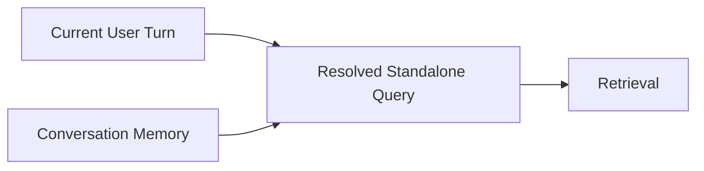

---

# 20. Frontend Architecture

The current frontend is a Next.js chat application.

Main capabilities:

- Natural-language question input.
- Chat message rendering.
- Suggested questions.
- Citation/source drawer.
- New-chat UI behavior.
- Error/loading states.
- Admin interface prototype.

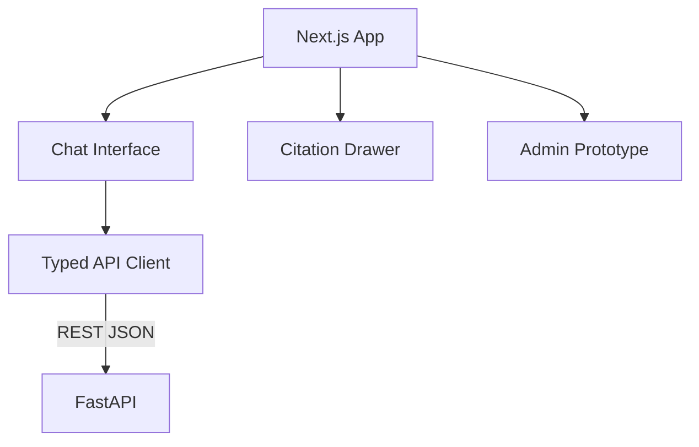

### Important status

The user chat UI is connected to the backend.

The admin review UI currently uses mock review data for several flows, so it should be described as a **prototype**, not a complete production admin workflow.

---

# 21. Authentication Status

`database/firebase/` and Firebase packages are present as authentication scaffolding.

## Status

🟡 Authentication components exist, but the current GraphRAG `/chat` path is not yet a complete authenticated multi-user conversation system.

Future architecture could be:

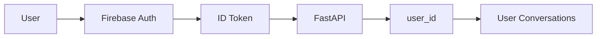

---

# 22. API Architecture

## Main endpoints

| Method | Endpoint | Purpose |
|---|---|---|
| `GET` | `/health` | Process liveness |
| `GET` | `/ready` | Dependency readiness |
| `GET` | `/api/v1/status` | Agent status |
| `POST` | `/api/v1/chat` | Grounded chat |
| `POST` | `/api/v1/analyze` | Non-conversational analysis compatibility endpoint |

## `/ready` checks

Current readiness considers:

```text
Database
Neo4j
LLM configuration
Embedding configuration
```

If a required dependency is unavailable, the service can return degraded/503 behavior.

---

# 23. Error Handling and Request IDs

FastAPI assigns each request a:

```text
X-Request-ID
```

If the client does not supply one, the backend generates it.

Benefits:

- correlate frontend errors with backend logs;
- identify failed requests;
- connect traces to a request.

Current API also maps failures into controlled categories such as:

```text
invalid_request
provider_unavailable
dependency_unavailable
internal_error
```

---

# 24. Observability with Langfuse

Langfuse is integrated around important runtime steps.

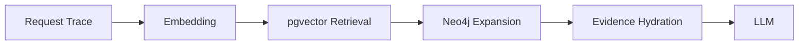

Trace spans include examples such as:

```text
retrieve-context
neo4j-connectivity
embedding-query
get-current-dataset
pgvector-search
neo4j-expand
hydrate-documents
chat-response
```

This enables later analysis of:

- latency;
- retrieval result counts;
- retrieved chunk IDs;
- LLM behavior;
- failure location.

---

# 25. Evaluation Architecture

The project contains a dedicated evaluation pipeline using a **golden dataset** derived from source data.

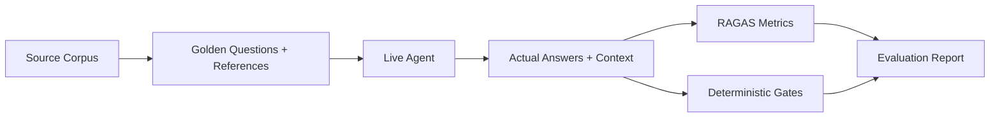

Metrics include areas such as:

```text
factual correctness
completeness
response relevancy
faithfulness
context precision
context recall
ID context recall
```

The project uses a threshold around:

```text
0.60
```

for core metric gating in the documented evaluation setup.

## Why evaluation matters academically

This provides a baseline for research experiments.

Instead of saying:

> "Hybrid search feels better."

we can measure:

```text
Baseline semantic retrieval
        ↓
Metric A

+ Lexical retrieval
        ↓
Metric B

+ PageIndex
        ↓
Metric C

+ Rerank
        ↓
Metric D
```

---

# 26. Deployment Architecture

Current Docker Compose runs the backend container while external data services are managed separately.

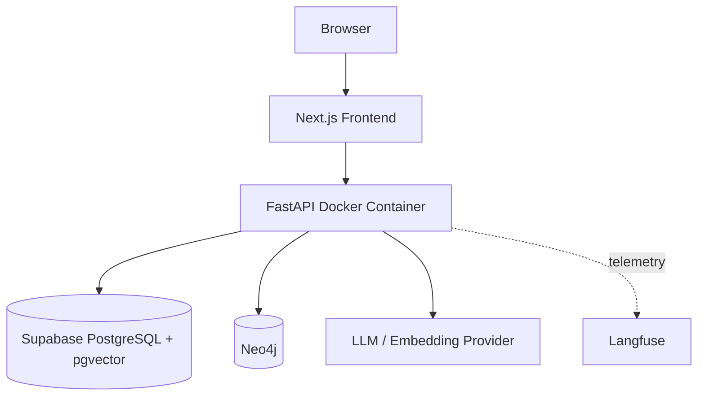

The backend has a Docker health check against:

```text
/health
```

---

# 27. Current Strengths

## 27.1 Clear separation of responsibilities

```text
Frontend
API
Agent orchestration
Retrieval repository
External integrations
Data pipeline
Evaluation
```

are separated into modules.

## 27.2 Evidence-first answering

The LLM is intended to answer from retrieved evidence, with fallback when evidence is missing.

## 27.3 Graph + vector combination

The system already explores more than plain vector RAG:

```text
semantic seed
→ legal graph expansion
→ text hydration
```

## 27.4 Release-scoped corpus

The staging/active dataset model is stronger than a simple mutable document table and supports reproducibility.

## 27.5 Evaluation exists

A formal evaluation framework creates a strong basis for research iterations.

## 27.6 Observability exists

Langfuse traces allow retrieval and LLM failures to be inspected rather than guessed.

---

# 28. Current Limitations

This section is important when discussing future supervision.

## 28.1 Retrieval is mainly semantic-first

Current live path does not yet fully combine:

```text
Exact
+
Lexical
+
Semantic
```

Therefore exact legal identifiers and keyword-heavy questions may be missed.

---

## 28.2 PageIndex is not fully used online

The system builds:

```text
Document
→ Article
→ Clause
→ Point
```

but the live chatbot does not yet make this a primary retrieval channel.

---

## 28.3 Entity extraction is currently a scaffold

The `extract_entities` node currently represents the full query as a query entity rather than deeply extracting:

```text
document number
article
clause
point
legal topic
date
intent
```

---

## 28.4 No true conversation memory yet

`chat_history` reaches the API but is not integrated into AgentState/retrieval.

---

## 28.5 Context packing is character-budget based

A more robust approach would be token-aware and evidence-aware.

---

## 28.6 Citation is evidence-level, not claim-level

Retrieved chunks are cited, but each generated claim is not yet formally mapped and verified against its supporting evidence.

---

## 28.7 Guardrail is currently lightweight

Current guardrail mainly handles:

- sanitization;
- empty output fallback;
- citation construction.

It does not yet perform complete legal-claim verification or retrieved-context prompt-injection defense.

---

## 28.8 Neo4j is currently treated as a required dependency

The runtime verifies Neo4j before retrieval. A more resilient design could degrade to vector-only RAG for questions that do not need graph expansion.

---

## 28.9 Authentication / user isolation is incomplete

Current system is not yet a complete:

```text
user
→ conversations
→ ownership
→ row-level isolation
```

architecture.

---

## 28.10 Admin workflow is still a prototype

The UI exists, but some review data and workflows are mock-based.

---

## 28.11 OCR is not a completed runtime capability

Although the broader product idea mentions invoice/image understanding, the current implemented request-time path is text-first.

Do **not** present OCR as a completed core feature.

---

# 29. Architecture Gap: Designed vs Implemented

One source of confusion in the old repository is that an architecture document describes a richer target design:

```text
Exact
+ Lexical
+ Semantic
+ PageIndex
+ Neo4j
→ RRF
→ Rerank
```

However, the current live runtime is closer to:

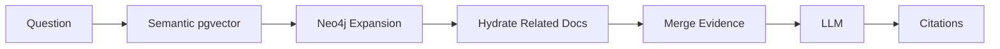

For presentation, use the second diagram as **current implementation**.

Use the richer design only as **future work / research roadmap**.

---

# 30. Proposed Research Roadmap

A useful supervisor discussion is not:

> "I want to add more technologies."

It is:

> "I want to test which architecture improves retrieval quality and grounded answering."

## Phase 1 — Strong Retrieval Baseline

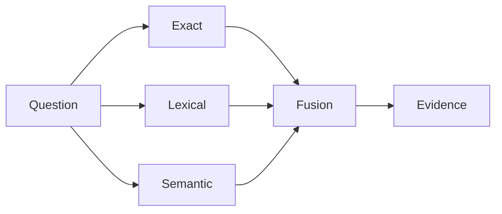

Research questions:

- Does hybrid retrieval improve context recall?
- How much does exact legal-ID lookup reduce failure cases?
- What fusion strategy works best?

---

## Phase 2 — Structured Legal Retrieval

Integrate:

```text
PageIndex
+
Article / Clause / Point resolution
+
Table-aware retrieval
```

Research question:

> Does legal-structure-aware retrieval outperform flat chunk search for Vietnamese regulations?

---

## Phase 3 — GraphRAG Improvement

Current:

```text
semantic seed
→ graph expand
→ first chunks from related docs
```

Proposed:

```text
seed
→ graph expand
→ re-retrieve specifically inside related documents
→ verify evidence
```

Research question:

> Does graph-guided re-retrieval improve relation-based legal questions without adding too much noise?

---

## Phase 4 — Conversation Context

Add:

```text
conversation_id
recent turns
summary
anchors
resolved_query
```

But conversation memory should only help understand the query.

Legal facts must still be re-retrieved from the corpus.

---

## Phase 5 — Evidence Verification

Add:

```text
reranking
claim-to-evidence mapping
citation validation
abstention
```

Research question:

> Can evidence verification reduce hallucination while preserving answer coverage?

---

# 31. Proposed Target Architecture

This is the **future target**, not the current implementation.

```mermaid
flowchart TB
    U[User]
    FE[Next.js]
    API[FastAPI]

    CONV[Conversation Context]
    PLAN[Query Resolution / Planner]

    EX[Exact Search]
    LX[Lexical Search]
    SM[Semantic Search]
    PI[PageIndex]

    FUS[Candidate Fusion]
    GRAPH[Neo4j Expansion]
    RERET[Graph-guided Re-retrieval]
    RR[Rerank]
    VER[Evidence Verify]
    PACK[Token-aware Context Pack]
    LLM[LLM]
    CLAIM[Claim-level Citation]
    ANS[Answer]

    U --> FE --> API
    API --> CONV
    CONV --> PLAN

    PLAN --> EX
    PLAN --> LX
    PLAN --> SM
    PLAN --> PI

    EX --> FUS
    LX --> FUS
    SM --> FUS
    PI --> FUS

    FUS --> GRAPH
    GRAPH --> RERET
    RERET --> RR
    FUS --> RR

    RR --> VER
    VER --> PACK
    PACK --> LLM
    LLM --> CLAIM
    CLAIM --> ANS
    ANS --> FE
```

---

# 32. Research Framing for a Supervisor

A strong way to frame this project academically:

> **The research problem is not simply to build a chatbot. The main problem is how to retrieve, structure and verify evidence from Vietnamese health-insurance/legal documents so that an LLM can answer accurately, transparently and with traceable citations.**

Potential research dimensions:

1. **Hybrid retrieval**
   - exact vs lexical vs semantic;
   - fusion methods.

2. **Structure-aware retrieval**
   - legal hierarchy;
   - Điều/Khoản/Điểm;
   - tables.

3. **GraphRAG**
   - graph expansion quality;
   - re-retrieval;
   - graph noise.

4. **Context engineering**
   - multi-turn query resolution;
   - evidence packing.

5. **Grounding and verification**
   - citation correctness;
   - claim-level evidence;
   - abstention.

6. **Evaluation**
   - retrieval recall;
   - faithfulness;
   - factual correctness;
   - latency/cost tradeoffs.

---

# 33. Suggested Experimental Methodology

A supervisor may ask:

> **“How will you prove your improvement?”**

Use an ablation-style evaluation.

```text
Experiment A:
Semantic-only baseline

Experiment B:
+ Exact search

Experiment C:
+ Lexical search + fusion

Experiment D:
+ PageIndex

Experiment E:
+ Graph re-retrieval

Experiment F:
+ Reranker / verification
```

Keep:

```text
same golden questions
same dataset release
same evaluator
same thresholds
```

Then compare:

```text
context recall
context precision
factual correctness
faithfulness
response relevancy
fallback rate
latency
token/cost
```

This converts the project from a feature-building exercise into a measurable research study.

---

# 34. How to Explain the Project in 60 Seconds

> **“My project is MediPay Agent, a GraphRAG-based assistant for Vietnamese health-insurance and hospital-fee information. The current system has a Next.js frontend and FastAPI backend orchestrated by LangGraph. At runtime, a user question is embedded and searched against legal-document chunks stored in Supabase PostgreSQL with pgvector. The retrieved documents become seed nodes for Neo4j, which expands related legal documents. The system then hydrates the actual text back from PostgreSQL, assembles evidence, and only then asks the LLM to generate an answer with citations.**
>
> **The project also already has a versioned data-ingestion pipeline, PageIndex-style legal structure extraction, table extraction, Langfuse tracing and a RAGAS evaluation framework. However, my current limitation is that the live retrieval is still semantic-first; lexical/exact retrieval, online PageIndex, conversation context and stronger evidence verification are not fully integrated. I would like to develop this as a research project focusing on improving retrieval quality and trustworthy grounded answers, and evaluate each architectural improvement experimentally.”**

---

# 35. Questions a Supervisor May Ask

## Q1. Why use Neo4j if vector search already exists?

**Answer:**

Vector search answers:

> "Which passages are semantically similar?"

Neo4j answers:

> "Which legal documents are explicitly related?"

They solve different retrieval problems.

---

## Q2. Why not just give all documents to the LLM?

Because:

- corpus is too large;
- token cost is high;
- irrelevant context increases hallucination;
- citations become difficult;
- latency increases.

RAG first selects a small evidence set.

---

## Q3. Why use LangGraph?

LangGraph makes the workflow explicit and extensible:

```text
intake
→ retrieve
→ context
→ generate
→ guardrail
```

Future steps such as query planner, verification, memory or reranking can be added as stateful nodes.

---

## Q4. Is this multi-agent?

**Current version: no.**

It is one LangGraph agent/workflow composed of multiple nodes.

A multi-agent design would require separate autonomous roles/agents with their own responsibilities and communication.

---

## Q5. What is the current biggest technical weakness?

**Retrieval quality.**

The system has many architectural components, but the live path is still primarily semantic-first and does not fully exploit lexical/exact/structured retrieval.

---

## Q6. What would be the main research contribution?

A reasonable contribution would be:

> Design and evaluate a hybrid, structure-aware GraphRAG retrieval pipeline for Vietnamese health-insurance/legal documents, with evidence-grounded generation and measurable citation quality.

---

# 36. Current vs Future — Final Summary

| Capability | Current old project | Research target |
|---|---|---|
| Frontend chat | ✅ | Improve UX/streaming |
| FastAPI | ✅ | Production hardening |
| LangGraph | ✅ | Richer planner/verification nodes |
| Semantic pgvector | ✅ | Keep as one channel |
| Exact retrieval | 🟡 Not in live path | ✅ |
| Lexical retrieval | 🟡 DB support, not live hybrid | ✅ |
| Neo4j graph | ✅ | Re-retrieve + better graph policy |
| PageIndex | 🟡 Offline built | ✅ Online retrieval |
| Table extraction | 🟡 Offline built | ✅ Structured retrieval |
| Evidence hydration | ✅ | More targeted |
| Reranking | 🔵 | ✅ |
| Citation | ✅ Evidence-level | Claim-level validation |
| Conversation memory | ❌ runtime | ✅ |
| Query rewriting | ❌ | ✅ |
| Langfuse | ✅ | Expand metrics |
| RAGAS eval | ✅ | Use for ablation studies |
| Dataset release versioning | ✅ | Extend cross-store parity |
| Firebase auth | 🟡 Scaffold | Multi-user ownership |
| Admin | 🟡 Prototype/mock | Real review workflow |
| OCR | ❌ Core runtime | Optional future scope |

---

# 37. Architecture Principle to Keep

The most important design principle for future development should be:

```text
Conversation memory
    helps understand the QUESTION

Retrieval
    finds the FACTS

Graph
    helps navigate RELATIONSHIPS

Canonical database
    provides the EVIDENCE

LLM
    explains the EVIDENCE

Evaluation
    proves whether the system improved
```

---

# 38. Final Architecture Summary

## Current implementation

```mermaid
flowchart LR
    USER[User]
    WEB[Next.js]
    API[FastAPI]
    AG[LangGraph]
    VEC[pgvector Semantic Search]
    NEO[Neo4j Expansion]
    DB[Supabase Evidence]
    LLM[LLM]
    CITE[Citations]

    USER --> WEB --> API --> AG
    AG --> VEC
    VEC --> NEO
    NEO --> DB
    VEC --> DB
    DB --> LLM
    LLM --> CITE
    CITE --> WEB
```

## Research evolution

```mermaid
flowchart LR
    BASE[Current GraphRAG]
    H[Hybrid Retrieval]
    P[PageIndex / Structured Search]
    G[Graph Re-retrieval]
    M[Conversation Context]
    V[Verification]
    E[Evaluation]

    BASE --> H --> P --> G --> M --> V --> E
```

---

# 39. Key Message for Supervisor

> **The current project is already a functioning GraphRAG prototype with a complete data → retrieval → graph → LLM → citation path. The main opportunity is not to add arbitrary technologies, but to systematically improve retrieval, context handling and evidence verification, then prove the improvement through controlled evaluation.**

This makes the project suitable for supervision as both:

- an **engineering system**, and
- an **experimental AI/RAG research project**.

