# MediPay Agent — Architecture đơn giản để học

> Bản này **không cố mô tả mọi chi tiết** trong repo nhóm.  
> Mục tiêu: nhìn 5 phút là hiểu hệ thống làm gì và dữ liệu đi như thế nào.

---

## 1. Kiến trúc tổng quát

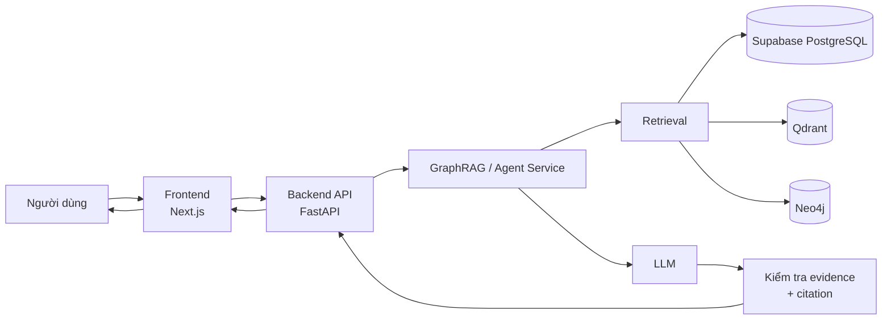

### Hiểu bằng một câu

**User hỏi → Backend đi tìm tài liệu → lấy đúng đoạn luật → đưa cho LLM → LLM trả lời dựa trên tài liệu đó.**

---

# 2. Ba database dùng để làm gì?

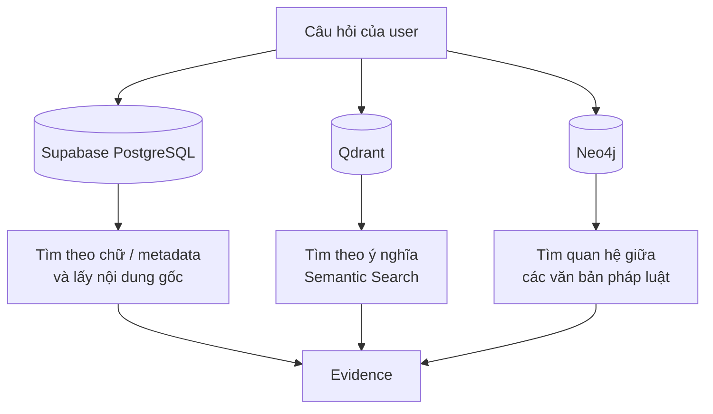

## Supabase PostgreSQL

Là **kho dữ liệu chính**.

Ví dụ lưu:

- văn bản
- chunks
- Điều / Khoản / Điểm
- bảng
- metadata
- nội dung gốc
- lexical search index

Nói đơn giản:

> **Muốn lấy nội dung thật để AI đọc → lấy từ Supabase.**

---

## Qdrant

Là **vector database**.

Nó dùng cho Semantic Search.

Ví dụ:

User hỏi:

> "BHYT khám khác bệnh viện có được thanh toán không?"

Trong tài liệu có:

> "Khám chữa bệnh không đúng nơi đăng ký ban đầu..."

Hai câu không giống chữ nhau nhưng gần nghĩa.

Qdrant giúp tìm ra đoạn đó.

```text
Câu hỏi
   ↓
Embedding
   ↓
Vector
   ↓
Qdrant
   ↓
Các chunk gần nghĩa
```

---

## Neo4j

Là **Graph Database**.

Nó không phải nơi chính để lấy text trả lời.

Nó lưu quan hệ kiểu:

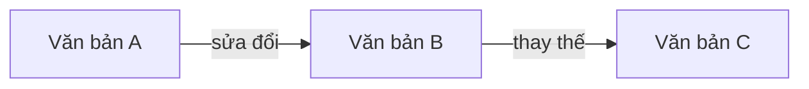

Nó giúp trả lời các câu như:

- văn bản nào sửa đổi văn bản này?
- văn bản này đã bị thay thế chưa?
- nghị định nào hướng dẫn luật này?
- văn bản nào liên quan?

> **Neo4j tìm đường. Supabase cung cấp nội dung thật.**

---

# 3. Luồng khi user hỏi một câu

Đây là phần quan trọng nhất của project.

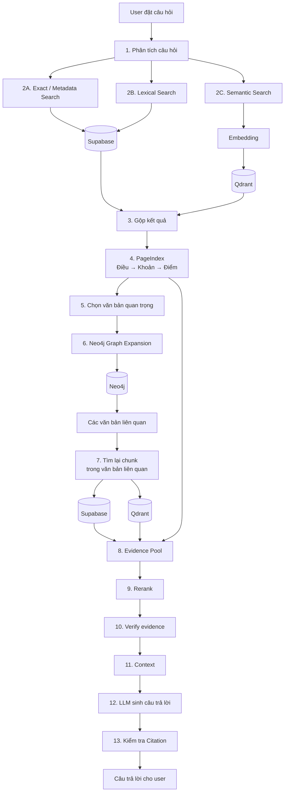

---

# 4. Hiểu 13 bước trên bằng ví dụ

User hỏi:

> **"Thông tư A đã bị văn bản nào thay thế?"**

### Bước 1 — Parse câu hỏi

Hệ thống nhận ra:

```text
Thông tư A
+
ý định: hỏi quan hệ "thay thế"
```

### Bước 2 — Tìm trực tiếp

Hệ thống tìm **Thông tư A** trong database.

Có thể dùng:

```text
Exact
Lexical
Semantic
```

### Bước 3 — Xác định document

Ví dụ tìm được:

```text
document_id = 123
Thông tư A
```

### Bước 4 — Neo4j

Hỏi graph:

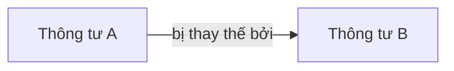

Neo4j trả về:

```text
Thông tư B
```

### Bước 5 — Rất quan trọng

**Không lấy text từ Neo4j để trả lời luôn.**

Hệ thống quay về Supabase/Qdrant:

```text
Thông tư B
   ↓
tìm chunk chứng minh quan hệ này
```

### Bước 6 — LLM

LLM nhận:

```text
Question
+
Evidence A
+
Evidence B
```

rồi mới trả lời.

---

# 5. Vì sao phải "Re-retrieve"?

Đây là ý quan trọng của kiến trúc nhóm.

Sai:

```text
Neo4j tìm thấy:
A → thay thế → B

→ AI trả lời luôn
```

Đúng:

```text
Neo4j tìm thấy:
A → thay thế → B

        ↓

Biết rằng cần kiểm tra B

        ↓

Tìm lại nội dung thật của B
trong Supabase / Qdrant

        ↓

Có evidence

        ↓

AI mới trả lời
```

Cho nên kiến trúc của nhóm được tóm tắt:

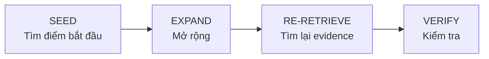

## Công thức nhớ

> **Seed → Expand → Re-retrieve → Verify**

---

# 6. PageIndex là gì?

Văn bản luật có cấu trúc:

```text
Chương
 └── Điều
      └── Khoản
           └── Điểm
```

PageIndex giúp hệ thống hiểu cây này.

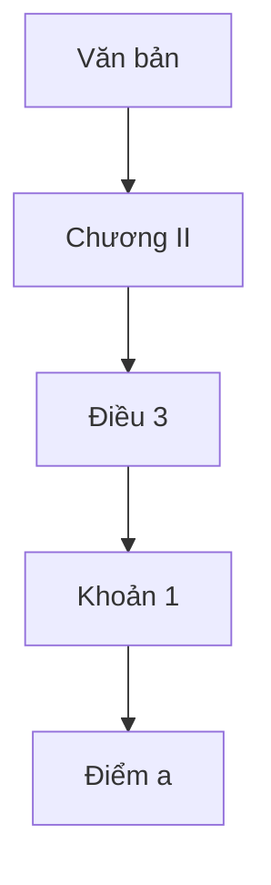

Ví dụ user hỏi:

> "Điểm a khoản 1 Điều 3 quy định gì?"

Hệ thống không tìm `"Điểm a"` trên toàn database.

Nó resolve:

```text
Document
 ↓
Điều 3
 ↓
Khoản 1
 ↓
Điểm a
```

---

# 7. Retrieval thực chất gồm những gì?

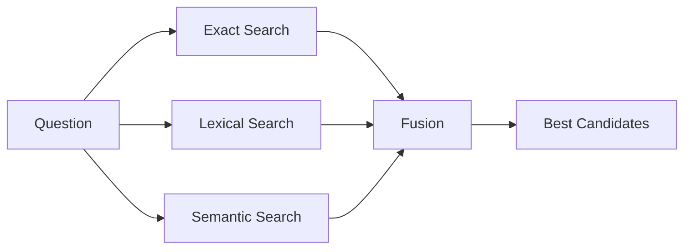

## Exact Search

Tìm đúng:

```text
111/2024/NQ-HĐND
Điều 3
Thông tư 01/2025/TT-BYT
```

---

## Lexical Search

Tìm bằng từ khóa.

Ví dụ:

```text
"khám chữa bệnh trái tuyến"
```

---

## Semantic Search

Tìm bằng **ý nghĩa**.

Ví dụ:

```text
"đi khám bệnh viện khác có được BHYT trả không"
```

có thể match với:

```text
"khám chữa bệnh không đúng nơi đăng ký ban đầu"
```

---

# 8. RRF / Fusion để làm gì?

Exact, lexical và semantic có thể trả ra kết quả khác nhau.

Ví dụ:

```text
Lexical:
A
B
C

Semantic:
B
D
A
```

Fusion sẽ gộp chúng:

```text
B
A
C
D
```

Sau đó mới chọn candidate tốt nhất.

Bạn chưa cần hiểu công thức toán lúc này.

Chỉ cần nhớ:

> **Fusion = gộp nhiều cách search.**

---

# 9. Rerank để làm gì?

Retrieval có thể tìm được 40 đoạn.

Nhưng LLM không cần đọc cả 40.

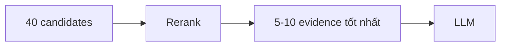

> **Retrieval tìm rộng. Rerank chọn kỹ.**

---

# 10. Verify để làm gì?

Đây là hệ thống liên quan luật/BHYT nên không nên để LLM trả lời từ tài liệu linh tinh.

Verify kiểm tra những thứ như:

```text
Evidence có thật sự liên quan không?
Có đúng document không?
Có đúng dataset/release không?
Citation có trỏ đúng nguồn không?
```

Sau đó mới đưa cho LLM.

---

# 11. Pipeline dữ liệu

Phần trên là lúc **user hỏi**.

Còn trước đó phải đưa dữ liệu vào hệ thống.

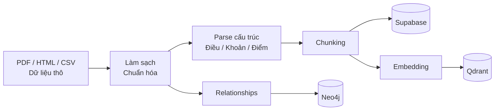

Tức là:

```text
DATA
 ↓
Clean
 ↓
Parse
 ↓
Chunk
 ↓
├── Supabase
├── Qdrant
└── Neo4j
```

---

# 12. Toàn bộ project nếu chia thành 5 phần

Để sau này tự làm lại, chỉ cần chia project thành **5 cục**.

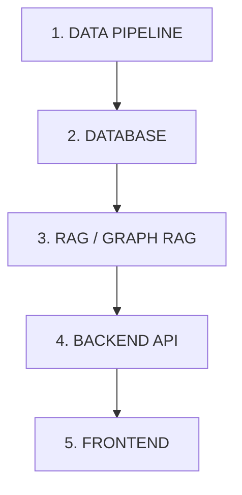

## 1. Data Pipeline

```text
Dataset
→ clean
→ parse
→ chunk
→ embedding
→ relationships
```

## 2. Database

```text
Supabase
Qdrant
Neo4j
```

## 3. GraphRAG

```text
Search
→ PageIndex
→ Graph
→ Re-retrieve
→ Rerank
→ Verify
→ LLM
```

## 4. Backend

```text
FastAPI
```

Nhận câu hỏi và gọi GraphRAG.

## 5. Frontend

```text
Next.js
```

Chat UI cho user.

---

# 13. Nếu tự làm lại từ đầu thì thứ tự nên là

Không làm cả kiến trúc trên cùng lúc.

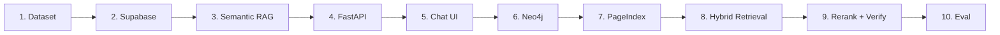

### Giai đoạn đầu

Chỉ cần:

```text
Dataset
→ Supabase
→ Embedding/Search
→ LLM
```

Có chatbot RAG chạy được trước.

### Sau đó

Thêm:

```text
Neo4j
PageIndex
Hybrid retrieval
Rerank
Verify
Eval
```

---

# 14. Sơ đồ cuối cùng cần nhớ

Nếu tất cả phần trên quá nhiều, **chỉ cần nhớ hình này**:

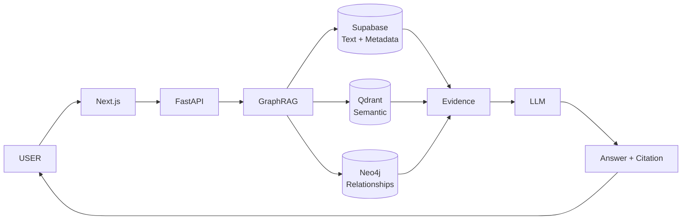

## Một câu để nhớ project

> **MediPay = Chatbot + RAG tìm nội dung + Neo4j tìm quan hệ pháp luật + LLM viết câu trả lời có citation.**
