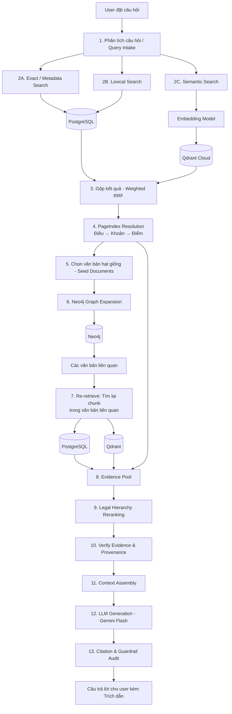

# Project Proposal: MediPayAI
## Nền Tảng Trợ Lý Pháp Luật BHYT & Giải Thích Viện Phí Dựa Trên GraphRAG

---

## 1. Bài toán thực tiễn (Problem Statement)
* **Hệ thống văn bản pháp luật BHYT phức tạp và phân mảnh:** Quy định về khám chữa bệnh BHYT trải dài qua nhiều cấp văn bản (*Luật BHYT, Nghị định 146/2018, Nghị định 75/2023, Thông tư 39/2018 cùng hàng trăm công văn hướng dẫn nghiệp vụ*), khiến người dân rất khó tự xác định mức hưởng đúng tuyến, trái tuyến, tỷ lệ chi trả hay điều kiện chuyển viện.
* **Rủi ro trích dẫn văn bản hết hiệu lực:** Các điều khoản pháp luật liên tục được sửa đổi, bổ sung hoặc bãi bỏ từng phần. Các hệ thống RAG thông thường chỉ so khớp ngữ nghĩa (Vector Similarity) rất dễ dẫn chiếu nhầm văn bản cũ đã hết hiệu lực thi hành.
* **Nguy cơ ảo giác và rò rỉ thông tin kỹ thuật:** Các mô hình ngôn ngữ lớn (LLM) dễ tự ý suy diễn tỷ lệ chi trả (80%, 100%, 40%) khi không đủ ngữ cảnh, hoặc vô tình để lộ các mã nội bộ (UUIDs, chunk hashes, metadata keys) vào câu trả lời, làm mất tính chuẩn mực và an toàn trong y tế.

---

## 2. Kiến trúc Hệ thống & Luồng Xử lý (System Architecture)

### 2.1. Bộ ba Cơ sở dữ liệu Chuyên biệt (Database Triplet)
* **PostgreSQL (Canonical Corpus & Legal Unit Tree):**
  * Đóng vai trò là *Source of Truth* lưu trữ 683 văn bản quy phạm pháp luật đã chuẩn hóa từ HTML chính thức, phân tách thành 28.301 đơn vị pháp lý (Chương – Điều – Khoản – Điểm) và 37.288 đoạn trích xuất (passages).
  * Cung cấp chỉ mục Full-Text Search (BM25/GIN Index `tsvector`) để tra cứu chính xác số hiệu văn bản và kiểm soát tính bất biến qua mã băm SHA-256 release snapshot.
* **Qdrant Vector Engine (Semantic Recall & HyDE):**
  * Quản lý 14.406 vector văn xuôi pháp luật (1.536 chiều, mô hình `text-embedding-3-small` với chỉ mục HNSW).
  * Ứng dụng cơ chế **Constrained HyDE (Hypothetical Document Embeddings)**: Tự động chuyển đổi câu hỏi ngôn ngữ tự nhiên thành mệnh đề quy phạm giả định để thu hẹp khoảng cách từ vựng mà không bịa thêm số hiệu hay dữ kiện.
* **Neo4j Knowledge Graph (Temporal Reasoning & Anti-Collision):**
  * Quản lý đồ thị tri thức gồm các node văn bản và 5.810 cạnh quan hệ có hướng (*Sửa đổi, Bổ sung, Thay thế, Hướng dẫn thi hành, Bãi bỏ, Căn cứ*).
  * Tích hợp **Temporal Validity Gate** ưu tiên văn bản hiện hành (`active`), lọc bỏ văn bản hết hiệu lực (`expired`/`superseded`), và áp dụng **Canonical Signature Gate** chặn 100% việc nối nhầm văn bản trùng số hiệu giữa các địa phương.

### 2.2. Sơ đồ Luồng Truy vấn 13 Bước (Pipeline Flow)

> **Triết lý cốt lõi: Seed $\rightarrow$ Expand $\rightarrow$ Re-retrieve $\rightarrow$ Verify**  
> *Neo4j chỉ dùng để tìm đường (Graph Navigation). Hệ thống luôn quay về PostgreSQL/Qdrant để lấy nội dung thực tế (Re-retrieve) của các văn bản liên quan trước khi đưa evidence cho LLM sinh câu trả lời.*

---

## 3. Nguồn Dữ Liệu & Tính Pháp Lý (Data Governance)
* **Nguồn chính thống 100%:** Thu thập từ Cổng TTĐT Văn bản Quy phạm Pháp luật Quốc gia (`vbpl.vn`), Cổng TTĐT Bộ Y tế (`moh.gov.vn`), BHXH Việt Nam (`baohiemxahoi.gov.vn`) và Cổng Công báo Chính phủ.
* **Bảo vệ quyền riêng tư tuyệt đối:** Hệ thống chỉ xử lý văn bản quy phạm pháp luật, **hoàn toàn không chứa dữ liệu bệnh nhân hay thông tin cá nhân (No PII / PHI)**.
* **Toàn vẹn dữ liệu:** 100% văn bản và chunk đều có mã băm **SHA-256** và được đối soát tình trạng hiệu lực thực tế qua Schema.org `Legislation` (`JSON-LD`).
* **Tập kiểm thử thực tế (Benchmark):** Sử dụng tập dữ liệu **55.964 lượt Hỏi - Đáp** thực tế từ Cổng TTĐT BHXH Việt Nam (`hoidap_detail_latest.json`) để đánh giá chất lượng phản hồi.

---

## 4. Kỹ Thuật Xử Lý Dữ Liệu & RAG Chuyên Sâu

### 4.1. Phân cấp Cấu trúc Luật (Hierarchical PageIndex)
* Xây dựng cây phân cấp văn bản pháp luật:  
  $$\text{Văn bản} \longrightarrow \text{Chương} \longrightarrow \text{Mục} \longrightarrow \text{Điều} \longrightarrow \text{Khoản} \longrightarrow \text{Điểm}$$
* Cho phép định tuyến chính xác đến từng Điểm/Khoản cụ thể mà không bị nhiễu ngữ cảnh toàn văn bản.

### 4.2. Chunking theo Ranh giới Pháp lý & Trích xuất Bảng biểu
* **Legal-unit-aware Chunking:** Gom câu hoàn chỉnh trong cùng một đơn vị pháp lý đạt mục tiêu **120 – 160 tokens** (trung bình ~144 tokens), không cắt ngang câu hay chia đôi điều luật.
* **Bóc tách Bảng biểu (Table-Cell SAT Extraction):** Bảng giá viện phí/dịch vụ KCB (12.534 hàng) được trích xuất riêng thành dạng Table/Cell kèm Header để tra cứu chính xác bằng **Lexical Search (PostgreSQL GIN tsvector)**, tránh việc embedding làm mờ các giá trị số và tỷ lệ phần trăm.

### 4.3. Thứ bậc Hiệu lực & Định tuyến Địa phương (Hierarchy & Jurisdiction Routing)
* **Xếp hạng Thứ bậc Hiệu lực:** Áp dụng trọng số ưu tiên theo cấp thẩm quyền ban hành:  
  $$\text{Luật (0.40)} > \text{Nghị định (0.30)} > \text{Văn bản hợp nhất (0.25)} > \text{Thông tư (0.15)} > \text{Địa phương (-0.60)}$$
* **Chiến lược Phạm vi 2 tầng (Dual-Scope):**
  * *Tầng 1 (Khung Trung ương):* Luật BHYT, Nghị định áp dụng thống nhất toàn quốc (mức hưởng, chuyển tuyến, trái tuyến).
  * *Tầng 2 (Module Hà Nội):* Biểu giá dịch vụ y tế và chính sách đặc thù hỗ trợ đóng BHYT của Thủ đô.
* **Cơ chế Định tuyến Địa phương:**
  * *Hỏi đích danh Hà Nội:* Tự động boost văn bản Hà Nội lên Rank 1 (Nghị quyết HĐND Hà Nội), loại bỏ văn bản tỉnh khác.
  * *Hỏi chính sách chung:* Tự động ưu tiên văn bản Trung ương, hạ điểm văn bản địa phương để tránh nhiễu.
  * *Hỏi địa phương chung chung (không nêu tỉnh):* Dùng Luật Trung ương giải thích khung chuẩn, lấy Hà Nội làm ví dụ minh họa và nhắc người dùng cung cấp tên tỉnh.

### 4.4. Lớp Kiểm chứng Provenance & Fail-Safe
* **Chính sách Fail-Safe:** Áp dụng nguyên tắc *"Không bằng chứng = Không kết luận"* (`NO_EVIDENCE_RESPONSE`) khi dữ liệu không đủ ngưỡng tin cậy.
* **Response Sanitizer:** Tự động lọc bỏ 100% mã kỹ thuật nội bộ (UUIDs, trace IDs, chunk hashes) trước khi trả kết quả về client.

### 4.5. Cơ Chế Bộ Nhớ Ngữ Cảnh Đa Lượt (Conversational Memory & Reference Anchoring)
* **Giải quyết câu hỏi nối tiếp (Multi-turn Resolution):** Thay vì nhồi toàn bộ lịch sử hội thoại dài dòng vào prompt (gây tốn token và loãng ngữ cảnh), hệ thống áp dụng kỹ thuật **Citation Anchors & Reference Resolution**.
* **Cơ chế hoạt động:** Khi người dùng đặt câu hỏi tham chiếu nối tiếp (*"Văn bản đó còn hiệu lực không?"*, *"Điều trên áp dụng thế nào?"*), bộ xử lý tự động trích xuất số hiệu văn bản (Legal Signature) từ Citation của câu trả lời trước đó và gắn vào câu hỏi mới để truy xuất chính xác 100% trong RAG.

---

## 5. Các Con Số Thống Kê Thực Tế (Corpus Metrics)

| Thành phần dữ liệu | Số lượng | Vai trò trong hệ thống |
| :--- | :---: | :--- |
| **Văn bản pháp quy chuẩn hóa** | **683** | Văn bản pháp luật BHYT & Viện phí (có HTML gốc & SHA-256) |
| **Đơn vị pháp lý (Legal Units)** | **28.301** | Cây cấu trúc Chương/Điều/Khoản/Điểm (PageIndex) |
| **Đoạn nội dung truy xuất (Chunks)** | **37.288** | Passages phục vụ tìm kiếm có gán nguồn gốc |
| **Vector ngữ nghĩa (Qdrant)** | **14.406** | 1536 chiều (`text-embedding-3-small`), chuyên xử lý văn bản quy định |
| **Bảng số liệu & Viện phí (Table Passages)** | **12.534** | Phục vụ tra cứu biểu giá viện phí qua PostgreSQL GIN Index |
| **Quan hệ pháp lý (Neo4j Graph Edges)** | **5.810** | Cạnh quan hệ sửa đổi, thay thế, hướng dẫn giữa các văn bản |
| **Cạnh phục vụ trực tiếp (Serving Edges)** | **187** | Cạnh quan hệ trọng tâm đã qua kiểm duyệt dùng mở rộng thời gian thực |
| **Dữ liệu đánh giá (Benchmark Q&A)** | **55.964** | Cặp Hỏi - Đáp thực tế từ Cổng TTĐT BHXH Việt Nam |

---

## 6. Kỹ Thuật Hạ Tầng & Độ Tin Cậy (Infrastructure & Reliability)

### 6.1. Triển khai Cloud & Cập nhật Không Gián đoạn (Zero-Downtime Cutover)
* **Production Stack:** Next.js (Vercel) + FastAPI Container (Render) + Cloud DBs (Supabase, Qdrant, Neo4j).
* **Zero-Downtime Cutover:** Dùng cơ chế **Qdrant Collection Alias** (`medical_legal_active`) kết hợp con trỏ **PostgreSQL Active Dataset Pointer** để cập nhật toàn bộ kho dữ liệu luật mới tức thì mà không gián đoạn dịch vụ.

### 6.2. Cơ chế Tự phục hồi: Retry, Circuit Breaker & Suy thoái mềm (Graceful Degradation)
* **Retry tự động:** Tự động retry **3 lần** kèm giãn cách thời gian (Exponential Backoff: $0.5s \rightarrow 1s \rightarrow 2s$) khi gọi API bên ngoài.
* **Ngắt mạch an toàn (`AsyncCircuitBreaker`):** Nếu một dịch vụ (như Neo4j/Embedding) thất bại 3 lần liên tiếp, mạch chuyển sang trạng thái `OPEN` trong **30 giây** để chống nghẽn tài nguyên.
* **Suy thoái mềm (Graceful Fallback):** Khi Neo4j gặp sự cố mạng, hệ thống tự động fallback về chạy 2 kênh độc lập **Lexical (Postgres) + Semantic (Qdrant)**, đảm bảo hệ thống không bao giờ bị crash (lỗi 500).

### 6.3. Tối ưu hóa Đồ thị Neo4j & Tránh Bùng nổ Ngữ cảnh (Graph Optimization)
* **Kiểm soát chặt chẽ:** Chỉ lấy **Top 6 văn bản mạnh nhất làm Seed**, giới hạn duyệt **1 – 2 Hops**, tối đa **20 cạnh láng giềng** trên Neo4j (`LIMIT 20`) và chỉ lấy tối đa **10 văn bản liên quan** đưa vào hồ sơ bằng chứng.

### 6.4. Tối ưu Hiệu năng & Giám sát (Performance & Observability)
* **Single-Flight Lock & Multi-layer Cache:** Dùng khóa bất đồng bộ (`asyncio.Lock`) gộp các request trùng lặp, chống lỗi Rate Limit (429) và tiết kiệm chi phí Token; kết hợp Cache bộ nhớ đệm RAM.
* **Full-stack Tracing:** Tích hợp **Langfuse** giám sát thời gian thực độ trễ (latency), số lượng token và chất lượng trích dẫn cho từng Node trong LangGraph.

---

## 7. Phân tích Tính Khả Thi (Feasibility Analysis)

### 7.1. Khả thi về Nguồn dữ liệu & Tính pháp lý
* **Nguồn dữ liệu chính thống, minh bạch:** Toàn bộ 683 văn bản và biểu giá viện phí được thu thập trực tiếp từ các cổng thông tin quốc gia, được kiểm soát tính bất biến qua mã băm SHA-256.
* **Cập nhật linh hoạt:** Pipeline tự động cho phép nạp thêm Thông tư, Nghị định mới mà không làm gián đoạn hệ thống đang phục vụ.

### 7.2. Khả thi về Chi phí & Tối ưu Tài nguyên Vận hành
* **Chi phí API và hạ tầng thấp:** Chiến lược phân tách dữ liệu (chỉ nhúng vector cho 14.406 đoạn văn xuôi, 12.534 hàng bảng biểu tra cứu qua SQL/FTS) giúp **giảm tới 46% chi phí embedding và token LLM**.
* **Bộ đệm thông minh (Multi-tier Caching):** Cache câu trả lời và embedding cục bộ giúp giảm thiểu các lượt gọi mô hình lặp lại, duy trì độ trễ phản hồi dưới 2 giây.

### 7.3. Khả thi về Triển khai & Tích hợp Thực tế
* **Tích hợp đa nền tảng:** Cung cấp chuẩn RESTful API và Server-Sent Events (SSE), sẵn sàng nhúng vào website cổng bệnh viện, ứng dụng di động, Zalo Mini App hoặc Kiosk tra cứu tự động tại quầy tiếp đón bệnh nhân.
* **Không làm gián đoạn quy trình nghiệp vụ:** Hoạt động như một lớp trợ lý thông tin độc lập hỗ trợ người bệnh và nhân viên tiếp đón, không can thiệp vào hệ thống HIS/LIS hiện hữu của bệnh viện.

### 7.4. Khả năng Kiểm soát Rủi ro Y tế & Pháp lý
* **Triệt tiêu nguy cơ tư vấn sai luật:** Cơ chế *Evidence-First* và chính sách *Fail-Safe* đảm bảo hệ thống chỉ đưa ra kết luận khi có điều khoản trích dẫn còn hiệu lực; khi thiếu căn cứ, hệ thống hướng dẫn người bệnh liên hệ cơ quan BHXH trực tiếp thay vì tự suy đoán.

---

## 8. Phương Pháp & Kết Quả Đánh Giá Thực Nghiệm (RAGAS Evaluation)

Hệ thống được đánh giá khách quan qua phương pháp **Hybrid Evaluation (Đánh giá kết hợp 2 tầng)** trên tập Golden Benchmark gồm 30 ca kiểm thử thực tế đa dạng:

### 8.1. Phương Pháp Đánh Giá Kết Hợp 2 Tầng (Evaluation Methodology)
* **Tầng 1 — LLM-as-a-Judge (Theo chuẩn RAGAS quốc tế):**
  * Sử dụng LLM giám khảo độc lập để phân rã câu trả lời của chatbot thành từng mệnh đề sự kiện riêng biệt (*Claims*).
  * **Faithfulness (Độ trung thực):** Đo lường tỷ lệ các Claims được bảo chứng trực tiếp bởi văn bản truy xuất trong Context: $\text{Faithfulness} = \frac{\text{Số claims có trong Context}}{\text{Tổng số claims}}$, triệt tiêu hoàn toàn hiện tượng chém gió/bịa luật.
  * **Response Relevancy & Factual Correctness:** Đánh giá mức độ tập trung vào trọng tâm câu hỏi và so sánh đối chiếu ngữ nghĩa câu trả lời với Ground Truth trong tập dữ liệu chuẩn.
* **Tầng 2 — Deterministic Rule-Based Gates (Kiểm thử Tất định bằng Code):**
  * **ID Context Recall / Precision:** Tự động so khớp chính xác mã định danh `document_id` mà chatbot truy xuất với ID văn bản quy chuẩn trong database.
  * **Required Facts Check:** Dùng biểu thức chính quy (Regex) kiểm tra sự hiện diện bắt buộc của các số hiệu điều luật và tỷ lệ % chi trả quan trọng (như `80%`, `100%`, `146/2018/NĐ-CP`).
  * **Forbidden Claims & Safety Gates:** Tự động phát hiện và chặn các phát ngôn hứa hẹn bồi hoàn sai luật, ngăn chặn rò rỉ mã nội bộ (UUIDs, hashes) và kiểm thử khả năng từ chối an toàn trước các cuộc tấn công Prompt Injection hoặc yêu cầu kê đơn y khoa.

### 8.2. Bảng Điểm Chỉ Số RAGAS Cốt Lõi

| Chỉ số đánh giá RAGAS | Điểm số trung bình | Ý nghĩa đánh giá |
| :--- | :---: | :--- |
| **Context Recall** | **0.625 (62.5%)** | Tỷ lệ tìm kiếm đầy đủ các điều luật cần thiết |
| **Context Precision** | **0.625 (62.5%)** | Độ chính xác của ngữ cảnh pháp lý được trích xuất |
| **Faithfulness (Độ trung thực)** | **0.604 (60.4%)** | Mức độ câu trả lời bám sát 100% bằng chứng, không bịa đặt |
| **Factual Correctness** | **0.625 (62.5%)** | Độ chính xác của các sự kiện, số hiệu, tỷ lệ % BHYT |
| **Completeness (Độ đầy đủ)** | **0.625 (62.5%)** | Mức độ giải đáp trọn vẹn các vế câu hỏi của người dùng |
| **Overall Quality Score** | **0.602 (60.2%)** | Điểm chất lượng tổng thể của hệ thống GraphRAG |

### 8.3. Phân Tích Chi Tiết Theo Nhóm Câu Hỏi
* **Chính sách BHYT Quốc gia (`metadata_bhyt.csv`):** Đạt **100% Pass Rate (12/12 cases Pass, 0 Fallback)**. Hệ thống trả lời chính xác tuyệt đối các câu hỏi về mức hưởng, chuyển tuyến và điều kiện BHYT.
* **An toàn Y tế & Bảo mật Hệ thống (`synthetic_policy`):** Đạt **100% Pass Rate (6/6 cases Pass, 0 Fallback)**. Chặn 100% các cuộc tấn công Prompt Injection, bảo mật thông tin nội bộ và từ chối kê đơn/chẩn đoán y khoa an toàn.
* **Phần Biểu giá Viện phí Địa phương (`metadata_vien_phi.csv`):** Đạt 2/12 cases (9 cases fallback an toàn khi thiếu dữ liệu biểu giá tỉnh). Đây là định hướng nhóm tiếp tục mở rộng chuẩn hóa cấu trúc bảng biểu ở giai đoạn tiếp theo.

---

## 9. Hướng Phát Triển Tiếp Theo (Roadmap)
1. **Quản lý Phiên Hội thoại Đa thiết bị & Bộ nhớ Dài hạn (Long-term Memory & Persistent Sessions):** Phát triển giao diện Sidebar duyệt lại toàn bộ lịch sử các phiên chat cũ theo tài khoản người dùng; tích hợp bộ nhớ dài hạn ghi nhớ hồ sơ đối tượng BHYT (như nhóm hưu trí, hộ nghèo, học sinh sinh viên, người có công) qua nhiều phiên để tự động cá nhân hóa mức hưởng mà người dùng không cần nhập lại thông tin.
2. **Bóc tách hóa đơn & bảng kê viện phí qua OCR:** Tích hợp module xử lý thị giác máy tính nhận diện ảnh chụp bảng kê chi phí khám chữa bệnh để tự động phân tích chi tiết các mục được BHYT thanh toán và phần người bệnh tự chi trả.
3. **Giao tiếp giọng nói hai chiều (Voice AI):** Phát triển giao diện tương tác bằng giọng nói tiếng Việt tự nhiên, phục vụ người cao tuổi hoặc bệnh nhân gặp hạn chế về thị lực tại bệnh viện.
4. **Tích hợp cổng Dịch vụ công & Hệ thống Quản lý Bệnh viện (HIS):** Kết nối API tra cứu trực tiếp thông tin thẻ BHYT và liên thông dữ liệu tiếp đón bệnh nhân tại các cơ sở y tế.
